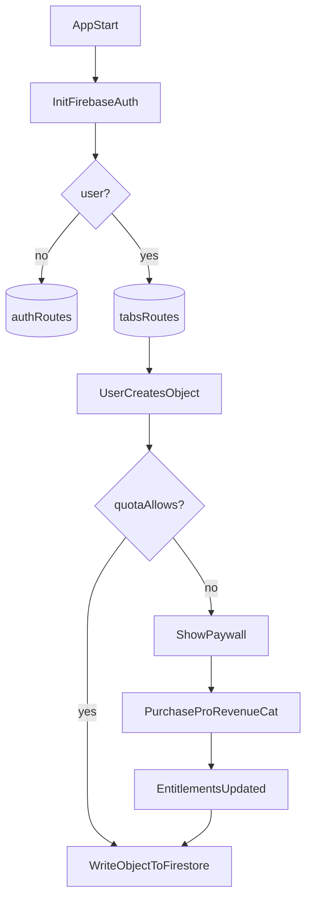

## Goals

- **Fast new-app spin-up** via a **GitHub template repo**.
- **Expo-managed** React Native app using **Expo Router** (file-based routing).
- **Firebase** foundation (Auth + Firestore-ready) with a clean, testable auth state layer.
- **Offline-first friendly**: support apps that need **local-first data + deferred sync** (optional module), while keeping the default template simple for online-first apps.
- **Baseline UI**: bottom tabs + a Settings screen (can be blank initially).
- **Freemium**: **RevenueCat entitlements** + **configurable quotas** (e.g. “create up to N objects for free”), designed so each app can define what “object” means.
- **Easy per-app customization** through a small config surface (name, icons, theme, quota object types, entitlement IDs).

## What we’ll reuse from `minimum_standards`

- **Auth-gated app shell** (show loading until auth initializes, then choose Auth vs Main). In `minimum_standards`, the key pattern is:

```23:45:/Users/benjaminmackenzie/Dev/minimum_standards/apps/mobile/src/navigation/AppNavigator.tsx
  // Show loading screen while auth state initializes
  if (!isInitialized) {
    console.log('[AppNavigator] Auth not initialized yet - rendering LoadingScreen');
    return <LoadingScreen />;
  }

  const destination = user ? 'MainStack' : 'AuthStack';

  return (
    <NavigationContainer>
      <RootStack.Navigator screenOptions={{ headerShown: false }}>
        {user ? (
          <RootStack.Screen name="Main" component={MainStack} />
        ) : (
          <RootStack.Screen name="Auth" component={AuthStack} />
        )}
      </RootStack.Navigator>
    </NavigationContainer>
  );
```

- **Simple, centralized auth store** concept (state: `user`, `isInitialized`, init once). For example:

```12:28:/Users/benjaminmackenzie/Dev/minimum_standards/apps/mobile/src/stores/authStore.ts
export interface AuthState {
  user: FirebaseAuthTypes.User | null;
  setUser: (user: FirebaseAuthTypes.User | null) => void;

  isInitialized: boolean;
  setInitialized: (isInitialized: boolean) => void;

  signOut: () => Promise<void>;
  initialize: () => () => void;
}
```

- **UI-kit driven tab styling** concept. In `minimum_standards`:

```84:96:/Users/benjaminmackenzie/Dev/minimum_standards/apps/mobile/src/navigation/BottomTabNavigator.tsx
  const tabBarStyle = getTabBarStyle(theme, insets);

  return (
    <Tab.Navigator
      screenOptions={{
        headerShown: false,
        tabBarActiveTintColor: theme.tabBar.activeTint,
        tabBarInactiveTintColor: theme.tabBar.inactiveTint,
        tabBarStyle,
```

We’ll adapt these patterns to **Expo Router** (redirects/route groups instead of stacks).

## High-level architecture (template repo)

- **Routing** (Expo Router):
  - `app/(auth)/sign-in.tsx`, `app/(auth)/sign-up.tsx`
  - `app/(tabs)/_layout.tsx` (Tabs)
  - `app/(tabs)/index.tsx` (Home)
  - `app/(tabs)/settings.tsx`
  - `app/paywall.tsx`
  - `app/_layout.tsx` (auth gate + global providers)
- **App config**: `src/config/appConfig.ts` defines the customizable bits per app.
- **Optional features**: `src/features/*` contains feature modules that are **not imported by default**. Apps choose which features to wire into screens/routes (and install any required deps).
- **Data layer (parameterizable online vs offline)**: `src/data/` exposes a small `Repository<T>` interface that screens/features use. Apps can choose:
  - **Online-first**: repository reads/writes Firestore directly (simple defaults).
  - **Offline-first (recommended for cost control + UX)**: repository reads/writes a local store first (SQLite), records an outbox operation, and a sync engine pushes/pulls changes in batches.
- **Firebase**: `src/firebase/` initializes Firebase and exports `auth`, `db`.
- **Auth**: `src/auth/` provides `AuthProvider` + `useAuth()` (or Zustand if you prefer) and exposes `user`, `initializing`, `signIn`, `signUp`, `signOut`.
- **Entitlements (RevenueCat)**: `src/billing/` wraps `react-native-purchases`, exposes `isPro`, `entitlements`, `restorePurchases`, and a `usePro()` hook.
- **Quotas / freemium gating**: `src/quota/` exposes `canCreate(objectKey)`, `assertCanCreate(objectKey)`, `incrementCounter(objectKey)` helpers, driven by `appConfig.quotas`.

### Optional feature: Dictation widget (`react-dictation`)

Many apps will use the dictation widget repo (`git@github.com:nine4-team/react-dictation.git`), but **not all**. The template should support a clean **per-app decision**:

- **Default**: dictation is **not installed** and **not referenced** anywhere, so apps that don’t need it have zero dependency/build impact.
- **Opt-in per app**: apps that need dictation:
  - install the dependency
  - add a small wrapper module under `src/features/dictation/`
  - wire the component into whatever screen(s) they want (e.g. a “New memory” screen)

Reference implementation lives in `/Users/benjaminmackenzie/Dev/memories` and should be used as the source-of-truth for how we wrap/style/use the widget once we scaffold the template code.

### Mermaid: auth + freemium gate




## Concrete implementation plan (no-codegen magic; clean defaults)

### 1) Template repo scaffolding

- Initialize an Expo app in this repo (TypeScript).
- Add `expo-router` and standard Expo tooling.
- Add project docs: `README.md` with “Use this template” steps.

### 2) `@nine4/ui-kit` integration

- Install `@nine4/ui-kit` (currently `0.1.0`, provides tokens/helpers like `lightTheme`, `typography`, `SCREEN_PADDING`, `getCardBaseStyle`).
- Create `src/theme/` that maps UI kit tokens into a simple app theme object used across screens.
- Provide 2–3 core primitives (`Screen`, `AppText`, `AppButton`) that consume tokens so apps don’t hand-roll spacing/typography.

### 3) Firebase foundation (Expo-managed)

- Use the Firebase JS SDK (`firebase/app`, `firebase/auth`, `firebase/firestore`) for Expo managed workflow.
- Create `src/firebase/firebase.ts` with initialization and exports.
- Add `.env.example` using Expo’s `EXPO_PUBLIC_` env vars for:
  - Firebase web config keys
  - RevenueCat public API key
  - (Optional) app-specific flags

### 3a) Firebase Emulator Suite (recommended default dev flow)

To avoid accidental costs and make iteration/test flows deterministic, the template should support running against the **Firebase Emulator Suite**.

- Include a `firebase/` folder with:
  - Firestore security rules + indexes
  - Optional Cloud Functions template used for quota enforcement
- Include `firebase.json` configured for:
  - Auth emulator
  - Firestore emulator
  - Functions emulator (optional)
- Document an **emulator-first** workflow in `README.md`:
  - local development connects to emulators by default (opt-out via env)
  - how to seed/reset emulator data
  - how to run “integration-ish” flows without touching prod

### 3b) Optional dictation widget (per-app)

- Add a documented opt-in integration path:
  - Template includes a `src/features/dictation/` folder with a wrapper component + types **but no imports from app routes by default**.
  - README includes a checklist: install dep + add screen integration.
- Do **not** require dictation dependency for the template to run.

### 4) Auth system (email/password baseline)

- Build a minimal auth flow:
  - Sign in / sign up screens
  - Auth provider that tracks `{ user, initializing }`
  - `app/_layout.tsx` gates routes by redirecting to `(auth)` when logged out and `(tabs)` when logged in
- Keep the “initialize once, show loading until initialized” behavior consistent with the pattern above.

### 5) Bottom tabs + Settings (Expo Router)

- Implement `app/(tabs)/_layout.tsx` with 2–4 tabs by default (Home + Settings at minimum).
- Use `@nine4/ui-kit` for tab bar styling where possible (or wrap/port the `getTabBarStyle` pattern to Expo Router tabs options).
- Settings page includes:
  - Sign out
  - “Restore purchases”
  - Placeholder sections for app-specific settings

### 6) RevenueCat “Pro” entitlement

- Add `react-native-purchases` integration with:
  - Initialization at app root
  - `usePro()` hook
  - `PaywallScreen` route (`app/paywall.tsx`) with simple purchase + restore
- Document that IAP testing requires **EAS build / dev client** (not Expo Go).

### 7) Data layer: online-first vs offline-first (parameterized)

Many apps will be offline-first. Rather than forcing a global choice, the template should provide a **stable abstraction boundary** so we can swap implementations per app (or even per feature).

- **Interface**: a small `Repository<T>` interface used by screens/services (list/get/upsert/delete).
- **Online-first implementation** (default): Firestore-backed repository (simple, fewer moving parts).
- **Offline-first implementation** (opt-in): SQLite-backed local-first repository + outbox queue + sync engine.
  - Sync defaults should be **cost-aware** (avoid always-on listeners): batch pushes, incremental pulls (`updatedAt > cursor`), and periodic/manual sync triggers.
  - Conflict strategy starts simple (e.g. server-wins / last-write-wins) and can be extended later.
- **Config surface** in `src/config/appConfig.ts`:
  - `dataModeDefault: 'online' | 'offline'`
  - per-entity overrides (mode, pull interval, conflict policy)

Reference patterns to lift from your existing work:

- `ledger`: outbox queue + scheduler/backoff + conflict hooks (architecture; implementation details differ since it’s web/IndexedDB).
- `memories`: simpler “queued mutations” pattern (good for lightweight entities).

### 8) Freemium quotas (customizable per app)

- Define quotas in `src/config/appConfig.ts`, e.g.:
  - `quotas: { objectKey: { freeLimit, collectionPath, displayName } }`
- Provide a generic “gating” API:
  - `canCreate(objectKey)` → boolean
  - `requireProOrQuota(objectKey)` → throws/returns “needs paywall”
- Persist counters in Firestore under `users/{uid}/quota/{objectKey}` (or a single `users/{uid}` aggregate), so quota survives reinstalls.
- **Offline-first policy (soft-limit)**: allow creates offline; on next sync the server enforces quota authoritatively. If exceeded, the client marks items as `needsPro` (or blocks server accept and shows the paywall state).

### 9) Server-side enforcement (recommended default)

Quotas and billing-related limits must be enforced **server-side** to be meaningful (client-side checks are UX only).

- Include a `firebase/` template with:
  - **Security Rules**: prevent bypassing quota/billing writes (rules are the guardrails)
  - **Cloud Function pattern**: perform “create + increment counter” in a transaction (functions are the authoritative operation)
- Default posture for quota’d creates:
  - apps call a function (authoritative)
  - rules restrict direct client writes to quota’d collections

This also plays well with offline-first: queued creates can be replayed against the function, and the server can accept/reject based on current entitlements and quota state.

## Deliverables

- A working Expo app from the template that:
  - Runs locally
  - Has auth screens + auth gating
  - Has tabs + Settings
  - Has a Paywall screen + RevenueCat wiring
  - Has a quota API with a sample object type
- Clear documentation for choosing **online-first vs offline-first** modes and the cost levers (listeners vs incremental pulls, batching).
- A clear “Customize your new app” checklist in `README.md`.

## Assumptions

- **Navigation**: Expo Router (your choice).
- **Freemium/payments**: RevenueCat (your choice).
- **Skeleton repo is currently empty**, so we’ll scaffold from scratch.

